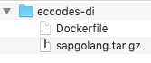

# Some Note about Docker on DI 
In general you can use any docker image to run on DI. You only have to ensure that it is correctly tagged so that the pipeline scheduler can select the appropriate docker container that provides the libraries required by the operators. 

You might run into the challenge of using operators having tags that none of the existing docker image complies with, e.g. 'flowagent' and 'python36'. Then either you

* group parts of the pipeline for running them in different docker containers with the caveat of the data volume restriction or
* enhance one of the images with the necessary packages

## Enhancing Existing Docker Images with Packages
SAP has an enterprise support aggreement with Suse and uses SLES as the basis for most of the operators. If you like for example add python packages like 'pandas' then you can select the base image with the reference character '$'

```FROM $com.sap.sles.base```

or directly pull the image from the repository with the reference character '§'

```FROM §/com.sap.datahub.linuxx86_64/sles:15.0-sap-003```

The latter might miss some enhancements that might be added to the Dockerfile in com.sap.sles.base.

Finally your new Dockerfile might look like: 


```
FROM $com.sap.sles.base
RUN python3.6 -m pip --no-cache-dir install 'pandas'
RUN python3.6 -m pip --no-cache-dir install 'scikit-learn'
```

It is very important that you tag the new Docker image not only with the newly added packages but also refer to the tags of the base image. There is currently no inheritance process in place. In our particular case it would like as 

 * default
 * sles
 * python27
 * python36
 * tornado - 5.0.2
 * pandas
 * scikit-learn

## Enhancing Existing Docker Images with new Libraries
Enhancing the SAP provided and maintained imagages has its limitations because you can only use 'pip' for installing python packages. If the use of 'apt-get' from ubuntu, 'zypper' from suse, .. is necessary then you have to fall back to openly available images. 

Fortunately there is already an image that contains the basic packages and can be enhanced as you like. It can be found in the *Modeler* repository/dockerfiles folder with the path: 

$com.sap.opensuse.golang.zypper

and the definition: 

```
FROM opensuse/leap:15.0

ARG GOPATH=/gopath
ARG GOROOT=/goroot

ENV GOROOT=${GOROOT}
ENV GOPATH=${GOPATH}
ENV PATH=${GOROOT}/bin:${GOPATH}/bin:/usr/local/sbin:/usr/local/bin:/usr/sbin:/usr/bin:/sbin:/bin

RUN zypper --non-interactive update && \
    # Install tar, gzip, python, python3, pip, pip3, gcc and libgthread
    zypper --non-interactive install --no-recommends --force-resolution \
    tar \
    gzip \
    python=2.7.14 \
    python2-pip \
    python3 \
    python3-pip \
    gcc=7 \
    gcc-c++=7 \
    libgthread-2_0-0=2.54.3 && \
    # Install tornado
    python2 -m pip --no-cache install tornado==5.0.2 && \
    python3 -m pip --no-cache install tornado==5.0.2

COPY sapgolang.tar.gz /tmp/sapgolang.tar.gz

RUN mkdir -p $GOROOT && \
    tar -xzf /tmp/sapgolang.tar.gz --strip-components=1 -C ${GOROOT}

```

and the tags

* opensuse
* python27
* python36
* tornado - 5.0.2
* sapgolang - 1.12.1-bin
* zypper

## Creating Dockerfiles - Advanced (for the not advanced)
If you need to build more complex Dockerfiles than just adding a couple of packages with pip then you are strongly adviced to do so locally first before adding lines in the Dockerfile on *SAP Data Intelligence* unless you are an exceptional OS-admin and Docker guru. If you belong to the more ordinary kind of developing data scientist, the multiple and fast try-and-error approach might be more appropriate. But nontheless you presumably have installed Docker locally and have a basic understanding of *Docker*.

As an example we are going to use the above mentioned image *opensuse/leap:15.0* and the basic extension of the Dockerfile  '$com.sap.opensuse.golang.zypper'. We will add the libraries for eccodes to read-process-write the GRIB/BUFR files used for storing weather data ([ecCodes Home](https://confluence.ecmwf.int//display/ECC)) and add some python packages that enables us to write new operators for the Modeler. 

### Preparation
Create a directory that contains the Dockerfile '$com.sap.opensuse.golang.zypper.Dockerfile' and 'sapgolang.tar.gz'



or take the adjusted one: 

```
FROM opensuse/leap:15.0

ARG GOPATH=/gopath
ARG GOROOT=/goroot

ENV GOROOT=${GOROOT}
ENV GOPATH=${GOPATH}
ENV PATH=${GOROOT}/bin:${GOPATH}/bin:/usr/local/sbin:/usr/local/bin:/usr/sbin:/usr/bin:/sbin:/bin

RUN zypper --non-interactive update && \
    # Install tar, gzip, python, python3, pip, pip3, gcc and libgthread
    zypper --non-interactive install --no-recommends --force-resolution \
    tar \
    gzip \
    python=2.7.14 \
    python2-pip \
    python3 \
    python3-pip \
    gcc=7 \
    gcc-c++=7 \
    libgthread-2_0-0=2.54.3 

RUN python3 -m pip install --upgrade pip
RUN python2 -m pip install tornado==5.0.2 
RUN python3 -m pip install tornado==5.0.2

COPY sapgolang.tar.gz /tmp/sapgolang.tar.gz
```

Open a terminal and go the folder and start a build process with ```docker build --tag eccodes ``` and after a some time you get with the command ```docker images``` the images

```
$ docker images 
REPOSITORY          TAG                 IMAGE ID            CREATED             SIZE
eccodes             latest              44b88839c5b3        44 seconds ago      661MB
opensuse/leap       15.0                7b6c420ec38e        9 days ago          104MB
```

with  ```docker images --all``` you see that it was a stacked building process where a lot of child images had been produced.  

```
$ docker images --all
REPOSITORY          TAG                 IMAGE ID            CREATED             SIZE
eccodes             latest              44b88839c5b3        3 minutes ago       661MB
<none>              <none>              4dbeed3246d5        3 minutes ago       533MB
<none>              <none>              ad60d5a15d70        3 minutes ago       530MB
<none>              <none>              773c4c187f90        3 minutes ago       526MB
<none>              <none>              4744b754f3a7        3 minutes ago       517MB
<none>              <none>              fbfaf8d1d6c0        11 minutes ago      104MB
<none>              <none>              55a13db79639        11 minutes ago      104MB
<none>              <none>              7cd45134c515        11 minutes ago      104MB
<none>              <none>              ab159e9ee696        11 minutes ago      104MB
<none>              <none>              c7eeb77d5357        11 minutes ago      104MB
opensuse/leap       15.0                7b6c420ec38e        9 days ago          104MB
```

If you now add new lines 

```
RUN zypper addrepo https://download.opensuse.org/repositories/home:SStepke/openSUSE_Leap_15.0/home:SStepke.repo
RUN zypper refresh
RUN zypper install eccodes
```

to the Dockerfile the good news is that the building process is much faster but unfortunately it runs into errors. Though a new image is been created with REPOSITORY and TAG value \<none\> that nonetheless cannot be deleted by ```docker image prune```. You have to forcefully remove it with ``` docker rmi --force [IMAGE ID]```.

Now the fun part starts where you start a docker container with the working image and step by step install what you need to learn the behaviour.

## Step by Step Installation
For the step-by-step installation you first need to run the container interactively using shell where you can test all your commands:

```eccodes-di d051079$ docker run  -it eccodes bash``` or
  
```eccodes-di d051079$ docker run  -it eccodes sh```

Now you can start with testing the first command: 

### 1. Command 
 ```9b07363dfa92:/ # zypper addrepo https://download.opensuse.org/repositories/home:SStepke/openSUSE_Leap_15.0/home:SStepke.repo ``` - No issue


### 2. Command

```
9b07363dfa92:/ # zypper refresh
Retrieving repository 'SStepke's Home Project (openSUSE_Leap_15.0)' metadata ---------------------------------------------------------------[\]

New repository or package signing key received:

  Repository:       SStepke's Home Project (openSUSE_Leap_15.0)               
  Key Name:         home:SStepke OBS Project <home:SStepke@build.opensuse.org>
  Key Fingerprint:  02C16E40 E54FD96B 57CBFA85 B1A9061F 7E4A4A2F              
  Key Created:      Tue Nov  6 15:33:51 2018                                  
  Key Expires:      Thu Jan 14 15:33:51 2021                                  
  Rpm Name:         gpg-pubkey-7e4a4a2f-5be1b45f                              


Do you want to reject the key, trust temporarily, or trust always? [r/t/a/?] (r): 
```
This is an interactive command where the default is not helping you at all. With some internet research you get answer by adding the option ```--gpg-auto-import-keys```.

### 3. Command
```9b07363dfa92:/ # zypper --non-interactive  install eccodes ``` runs when the option ```--non-interactive``` is added. 

Here we go. Now we have all the commands tested and the Dockerfile should run without complaints. 


 


 


## Reference
[SAP DI Help -  Create Docker](https://help.sap.com/viewer/29ff74dc606c41acad117003f6034ac7/2.6.latest/en-US/62d1df08fa384d0e88bbe9b7cbd2c3fb.html?q=docker)

[SAP DI Help - Docker Inheritance] (https://help.sap.com/viewer/29ff74dc606c41acad117003f6034ac7/2.6.latest/en-US/d49a07c5d66c413ab14731adcfc4f6dd.html)


