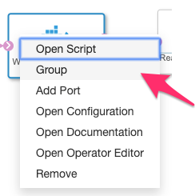

# Local Development of Python Custom Operators

## General Remarks about Programming with SAP DI
The core development environment for **SAP Data Intelligence** is the **Modeler**. Here you plug together all the processing steps you need for your **data pipeline**. You have hundreds of operators available that supports all kinds of requirements that you face in your daily business. Basically you can develop pipelines without writing scripts by just selecting and configuring operators. 

Admittedly this not the whole truth. You mostly cannot avoid creating your own custom operators but SAP Data Intelligence is designed in such a way that there are multiple ways for doing this. You just have to select which is the one that is the most appropriate. 

The architecture of **SAP DI** is based on  **kubernetes** and **containers**. The first is only of concern for developers when questions of performance and scaleablity has a direct impact on how-to design a solution. The latter defines the development environment more directly and some basic understanding could be of great help. 

Most importantly all pipelines run within one or more containers that are build when a pipeline has been created or modified. The **SAP DI** modeler engine tries to put all operators within one container for obvious resource saving reasons. Which base image is been chosen is determined by the tags of the operators. 

With the grouping feature 

1. Right-click on one operator
2. Select 'Group' and 
3. Finally draw the new blue rectangle to encompass all operators for grouping

you can force that all operators run within one container that complies to the added tags. 

 
 

If there is no image that complies to all tags you get immediatley an error message when the pipeline is started. The tagging and grouping is an important and powerful tool but needs a careful planning. Currently there is no support offered by the **Modeler** that helps to understand the dependancies of operators, pipelines and available base images. 


Trying to run all operators in one container is an important feature because it enables you to access the same memory space and therefore enables you to send data/messages of sizes that are only constrained by the available memory resources. Messages that are forced to bridge containers have currently a size limit of 10MB. 

Generally you have three options of creating you own operators

1. Using the **Modeler Wizzard** for creating within **SAP DI**
2. Develop locally and **import the operators as solution**
3. Adding your **code in a container** (e.g. you have legacy code that you do not want to touch by all means) - a blog as planned

The sequence of the enumaration roughly coincides with the complexity the operator covers. As first rules I suggest the following : 

1. A Couple of script lines (<15 lines) with a few (0-3) configuration parameters
2. More than 15 lines of code with some logic based on more than 3 configuration parameters
3. Compiled code or complex scripts that has been developed already perhaps using programming languages that are currently not supported (FORTRAN, C, Java,..). 

After a short overview of how to use the **Modeler Wizzard** and describing the basics paradigms the main focus of this blog is the local development of operators. 


## Wizzard-based Creation of new Operators
With SAP Data Intelligence you can create new custom Python operators using the *modeler* wizzard. When being in the operator context (Operators Tab) of the tools pane at the left part of the *modeler* screen click the '+'-Button.


and the wizzard leads through the five steps of defining a new operator: 

* **Ports** for the input and output of data
* **Tags** for selecting the best base container
* **Configuration** for defining the parameters
* **Script** for the Python-code
* **Documentation** for the manual


This is the stratightforward way of creating operators with only a few parameters and limited numbers of code lines where you do not need any debugging. As soon as you expect some sytax errors will creep in and you are not sure forseeing all logical implications then the development in the **Modeler**-environment will get a nuisance. It takes a minute to run the code and there is no debugging except of adding print statements. Of course you can upload a script that you have written locally. This is of tremendous help if your operator has limited complexity and you mostly want to avoid syntax errors. For the more sophisticated operators you need another approach that supports 

* testing of operators that simulates the behaviour when running in a DI pipeline very closely
* maintaining the lifecycle in github
* controlling all the configuration parameters of an operator without the need to use the *modeler* wizzard
* Uploading the locally developed operators to a SAP DI instance (not cut and paste)

All These items will be addressed in the following chapters.

## Custom Operator Structure
When adding a Python custom operator to the pipeline there are commented examples of how to access the port and configuration parameters and see the general structure a custom operator has to follow.

Simplest example:  

```
def on_input(data):
     global counter
     counter += 1
     api.send("output", str(counter))

api.set_port_callback("input", on_input)

```

You find a documentation of all methods that can be used at [SAP Help Portal](https://help.sap.com/viewer/97fce0b6d93e490fadec7e7021e9016e/Cloud/en-US/021180336add475bbd712b0ce5d393c1.html)

The most important function is ```api.set_port_callback(<portname>, <callback function>)``` which is called when a new message arrives at the named port. If input from more than one port is needed an array of ports can be passed. The callback function needs the same number of arguments as the number of ports in the ports array. 

For sending messages out the function ```api.send(<port>,<data>)``` is used. 

For accessing the configuration parameters the class ````api.config``` provides a direct access to the configuration variables : ```api.config.<variable>```

So far so easy, 

## Local Testing of Custom Operators
Of course you can test the syntax of the script when using a Python development environment but the missing definitions of the global variables ```api.message``` and ```api.config``` will be complained. To avoid to import any SAP DI packages you can mimick these classes. But you have to ensure that your local definition is only used when there are no global definitions. Otherwise you always have to delete the class definition before you upload the script. The most common pythonic way to test the existance of a class, is the ```try - except NameError``` - trick: 

```
try:
    api
except NameError:
    class api:
        class config:
            var1 = 'foo'
            var2 = 'bar'

        class Message:
            def __init__(self,body = None,attributes = ""):
                self.body = body
                self.attributes = attributes

        def send(port,msg) :
            print('Port: ', port)
            print('Attributes: ', msg.attributes)
            print('Body: ', str(msg.body))

        def set_port_callback(port, callback) :
            test_msg = api.Message(attributes={'name':'doit'},body = 3)
            callback(test_msg)

def process(msg):

    # start custom code
    result = ''
    for i in range (0,msg.body) :
        result += str(i) + ':' + api.config.var1 + ' - ' + api.config.var2 + '    '
    msg = api.Message(attributes={'name':'concat','type':'str'},body=result)
    # end custom code
    api.send("output", msg)


api.set_port_callback('input', process)		
```

If you want to do more elaborated tests with different messages and configurations you would rather add a main()-function and decouple the ```process()```-function and the ```api.send()``` by adding an intermediate function-call ```call_on_input(msg)```. This enables you to define an additional function ```api.call(config, msg)``` that returns the results directly and thus can be better compared with the expected results. 

The drawback is that you have to care to comment the lines starting with ```#if __name__ == '__main__':``` and maybe uncomment the line  ```api.set_port_callback('input', process)```.

```
try:
    api
except NameError:
    class api:
        class config:
            var1 = 'foo'
            var2 = 'bar'

        class Message:
            def __init__(self,body = None,attributes = ""):
                self.body = body
                self.attributes = attributes

        def send(port,msg) :
            print('Port: ', port)
            print('Attributes: ', msg.attributes)
            print('Body: ', str(msg.body))
            return msg

        def set_port_callback(port, callback) :
            default_msg = api.Message(attributes={'name':'doit'},body = 3)
            callback(default_msg)

        def call(config,msg):
            api.config = config
            return process(msg)


def process(msg):

    result = ''
    for i in range (0,msg.body) :
        result += str(i) + ':' + api.config.var1 + ' - ' + api.config.var2 + '    '
    return api.Message(attributes={'name':'concat','type':'str'},body=result)


def call_on_input(msg) :
    new_msg = process(msg)
    api.send('output',new_msg)

#api.set_port_callback('input', call_on_input)

def main() :
    print('Test: Default')
    api.set_port_callback('input', call_on_input)

    print('Test: config')
    config = api.config
    config.var1 = 'own foo'
    config.var12 = 'own bar'
    test_msg = api.Message(attributes={'name':'test1'},body =4)
    new_msg = api.call(config,test_msg)
    print('Attributes: ', new_msg.attributes)
    print('Body: ', str(new_msg.body))


if __name__ == '__main__':
    main()

``` 

With this code template you can test your code locally but you still have to use the **Modeler** operator wizzard to create the operator, adding all the tags, ports and config parameters manually and finally upload your code. 

## Solution Generation of Locally Developed Custom Operator
Of the four requirements that I have stated 2 chapters ago for a satifying local development of custom operators we have reached the first step. Two of the left over will be tackled now. For that it helps to understand where and how the operators are stored in **SAP DI**. 

Operators are stored like packages using folders as namespaces. Though you will find the custom Python operators in the /vrep-file system that you can examine using the **System Managment** - Files in 'My Workspace'. Under /files/vflow/subengines/com/sap/python36/operators you are going to see all your operators. It is always a good idea to group your operators in packages that means you have at least one parent folder before you see the folders of your operators. You will have at least 4 files defining your operator: 

1. README.md - documentation
2. configSchema.json - defining the configuration parameters
3. operator.json - general information about ports, default values, etc.
4. <customOperatorName>.py - containing the script
5. <icon-name>.svg - (optional) own operator icon

The task is to create these files mostly automatically and having only one source of truth: the operator script. So we had to add some further information to the custom code that enables the generation of all the necessary files. Fortunately there is not very much to add. 

### Adding Ports 
For adding the ports you have to provide the name and the type for all the ports: 

```
inports = [{"name":"input","type":"message"}]
outports = [{"name":"output","type":"message"}]

def call_on_input(msg) :
    new_msg = process(msg)
    api.send(outports[0]["name"],new_msg)

api.set_port_callback(inports[0]["name"], call_on_input)

```

### Adding Configuration Description
For the configuration parameters additional information is required:

* title
* description
* type

That means that for all config variables a dictionary is needed containing the data. 
```
config_params['filename'] = {'title': 'Filename', 'description':'Filename (path)', 'type':'string'}
```

### Misc Meta Data
Finally for completing the operator definition the script needs to provide


* **tags** with version
* **version** of the operator for creating the manifest.json
* **operator description** 


```

tags = {'python36': ''}  # tags that helps to select the appropriate container
            operator_description = 'Read File from Container'
            version = "0.0.2"  # for creating the manifest.json

```

Altough it might not belong to the configuration context but it is stored in the ```api.config```-class for convinient purpose. 

Finally we have all definitions that we need to generate a solution package. 


### Generating the Solution

Now all the information that is needed for generating a **DI operator** is available in the script. If you follow the advised structure of the previous chapter then you can use a scipt I have created: **gensolution**. This is currently a publicly available script under the MIT-licence. So you can use and enhance it at your will. The script is part of python package **sdi_utils** where I put all my helper functions. 

**gensolution** provides two ways to generate a solution package: 

* Calling it in the main()-function of a custom operators
* Using the commandline to create a package consisting of a number of packages with more than one operator at once. 

#### Installation

* [Public github reposition](https://github.com/thhapke/sdi_utils)

The intallation could be done manually or using pip: 

``` python3 -m pip install sdi_utils```

Final note: I have tested and used it only on macos so far. 

#### Commandline

```
usage: gensolution [-h] [--project PROJECT] [--version VERSION] [--debug]
                   [--zip] [--force] [--reverse] [--package PACKAGE]
                   [--operator OPERATOR]

Generate SAP Data Intelligence solution for local operator code

optional arguments:
  -h, --help           show this help message and exit
  --project PROJECT    <new project path> - creates new project with required
                       folder structure
  --version VERSION    <version> in format <num.num.num>
  --debug              For debug-level information
  --zip                Zipping solution folder
  --force              Removes subdirectories from <solution/operators>
  --reverse            Ceates a custom operator script from solution package
  --package PACKAGE    <package name> for reverse custom operator creation
  --operator OPERATOR  <package.operator folder> for reverse custom operator
                       creation
```


##### Setting up Project: Option --project

**gensolution** expects that not only the meta-data is provided as described in the chapter "Solution Generation of locally Developed Custom Operator" but also a fixed structure of the project. This can be generated automatically with ```gensolution --project <path/project name>```. Alternatively you can create the path manually and change to the project folder an call ```gensolution --project .``` In the folder "src/<projectname>/ " you find a "customOperatorTemplate.py" that can be used for a start. 

```
|_ project
     |_ src 
         |_ <package1>
         		|_ <operator11>
         				|_ <operator-script11>.py
         		|_ <operator12>
         				|_ <operator-script12>.py
         		...
         				
         |_ <package2> 
         
```

##### Reverse engineering: Option --reverse 

Because I had also that case that I started the development of a new operator in **DI Modeler** and afterwards realized that the script becomes rather complicated or for all my older operators, I added the option to read the **configSchema.json** and **operator.json** and create a local script accordingly. Please be aware that is not doing any code inspection of the operator script. This script is copied to the new local folder with the prefix 'old_' and the code snippets had to cut and paste to the right text locations. 


For more and updated information about **gensolution** have a look on **github**.

#### 	Call in main() of operator.py
If you only like to develop just one operator for a package then you can also add a "gensolution"-call in the main()-call:

```gs.gensolution(os.path.realpath(__file__), config, inports, outports)```

## Conclusion
After some general remarks about how to develop custom operators we delved into a kind of 'my'-best practise for developing custom operators locally that enables you to develop and test operators locally outside of **DI** and easily import them as a solution to your **DI** instance. 

Please let me know if this helps you or what do you think should be improved or enhanced. 


 


 

