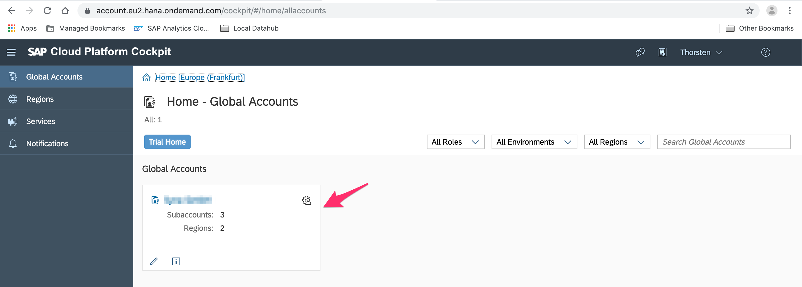
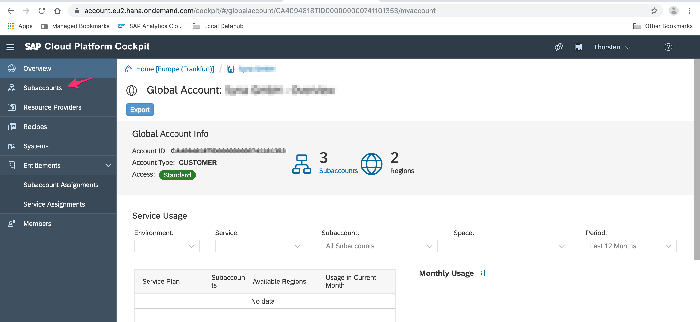
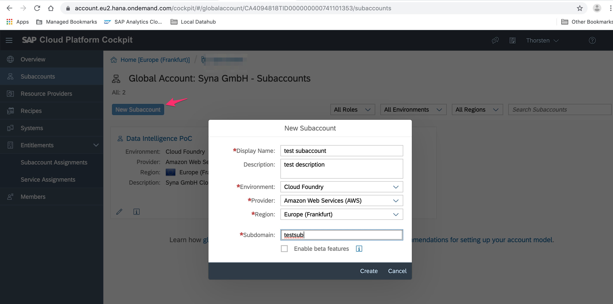
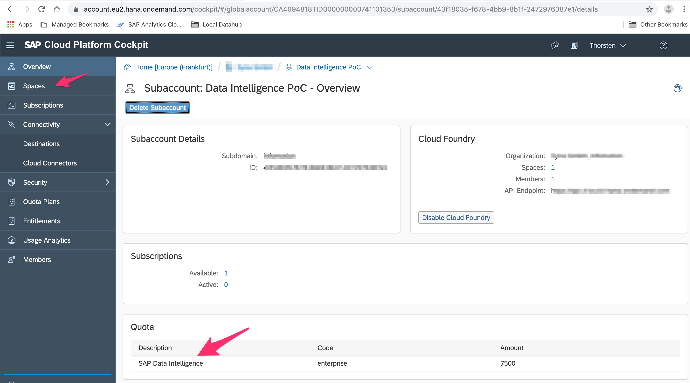
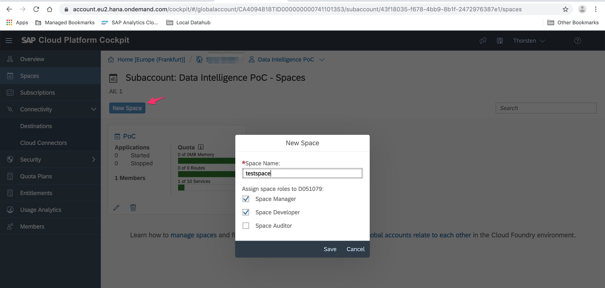
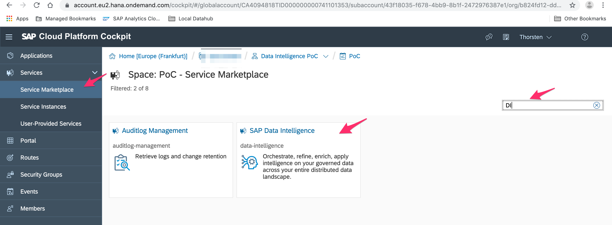
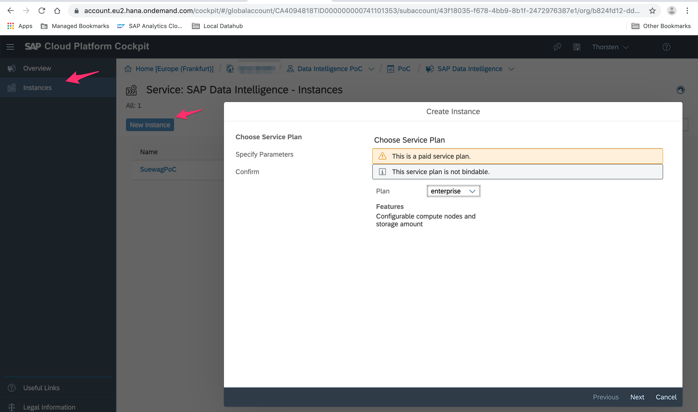

# New SAP Data Intelligence Instance on SAP Clound Platform

This is a straight forward guidelind for creating an DI instance on SCP without presuming too much knowlegde about SCP. Nonetheless there is no harm if having some spare time onhand to read the manual: 

https://help.sap.com/viewer/65de2977205c403bbc107264b8eccf4b/Cloud/en-US/73beb06e127f4e47b849aa95344aabe1.html

As a pre-requisite it is assumed that ..

* there were  already cloud credits assigned to the global account and
* admin authorization has been granted. 

## Global Account Landing Page

## Creating SubAccount

Click on *Subaccount* 

Click on *New Subaccount* for creating a new one  on *Cloud Foundry*. The subdomain can be any name that will be part of the url (-> only letters)

Finally you have a sub account with the available quota of SAP Data Intelligence already assigned to: 

## Creating a Space
You need to create a space that carries the quota. Assumingly the new space consumes all available quota provided by the cloud credits.

## Creating an DI Instance

Once a Subaccount and a space exists then you are finally enabled to create a DI instance. For doing this go in the menue to the *Service Marketplace* and search for *Data Intelligence*.  

There you can create a new Data Intelligence Instance: 

