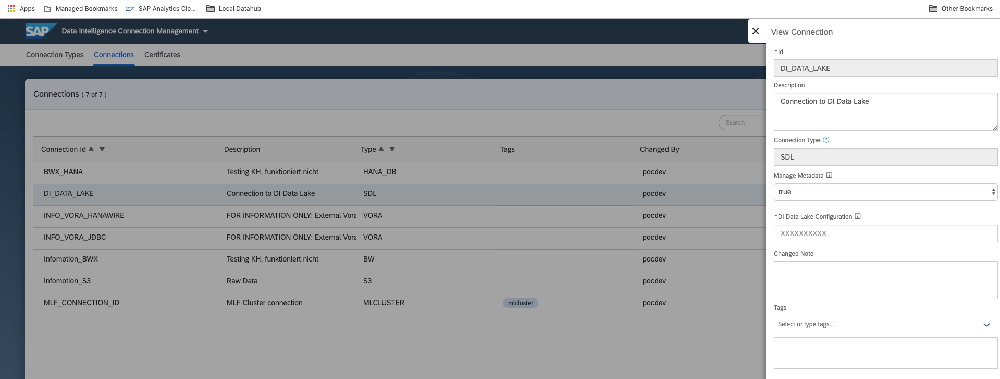
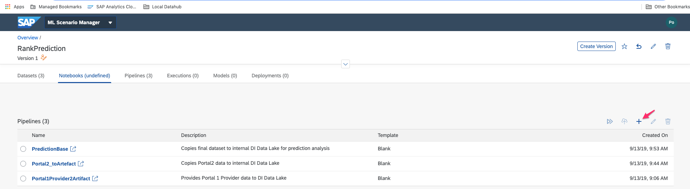
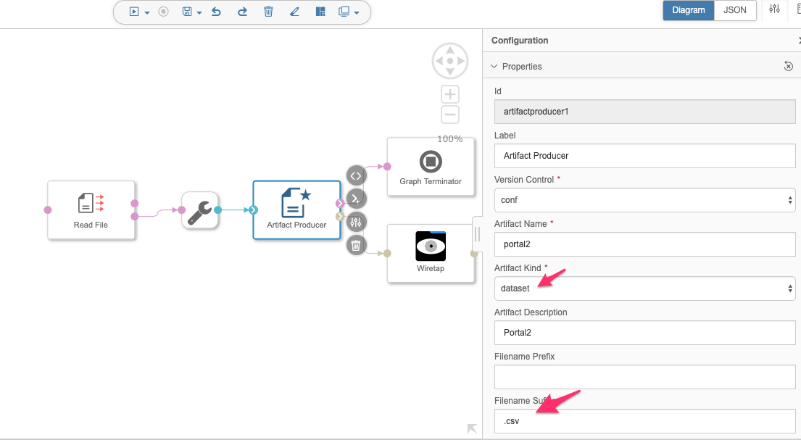
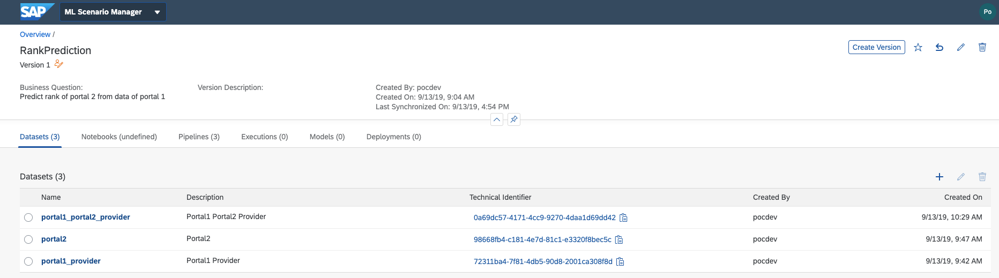
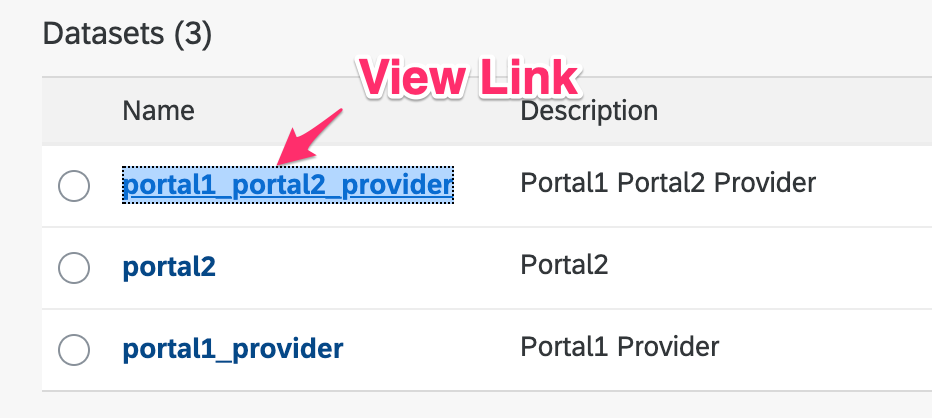
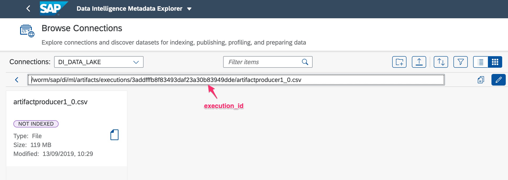

# SAP Data Intelligence and Jupyter Notebook
Currently it is still kind of awkward to use the Jupyter Notebook environment with SAP Data Intelligence. But we hope it will soon improve. In the meanwhile when you like to use data and data source you can use the following guideline. 

# Scenario Manager 
The scenario manager is the entry point that encompasses 

* Datasets - created with the Scenario manager
* Jupyter Notebooks
* Pipelines - created with the Scenario Manager

## Scenario Manager Pipelines
When you like to access DI data you need first copy it to the internal DI Data Lake that is a pre-defined connection to a *Semantic Data Lake (SDL)*. 

### Copied from SAP SDL Help: 
### Semantic Data Lake (SDL)


Allows connecting to a Semantic Data Lake. For Data Intelligence (cloud only), a connection, DI\_DATA\_LAKE, is pre-defined.

**Features** 

* Use in model training and model serving with Machine Learning scenarios

* Experiment with data using JupyterLab in the context of Machine Learning

* Read and write data in Modeler via Read File, Write File, and Flowagent File operators

* Explore content using Metadata Explorer's Browse Connections capability

* Obtain metadata and execute data profiling using Metadata Explorer

* Perform data operations in Modeler via Data Transform operator



## Creating a Data Set Pipeline

When creating a data pipeline with the Scenario Manager it is managed by an internal *Git*. If you want to use an existing pipeline you need to create an empty pipeline from the Scenario Manager and then copy the JSON code to it. 



After the **Modeler** has been started you can create a simple pipeline that reads the data from a source/connection and writes it to the DI\_DATA\_LAKE. The following pipeline reads an *csv-file* from an object store. 



In the configuration be a aware of the parameters

* *Artifact Kind*: dataset and 
* *Filename suffix*: .csv

After the completion of the pipeline a new **data** set is been created. 



## Viewing a Data Set in Metadata Explorer

For viewing the dataset in the **Metadata Explorer** you need the **execution_id** (not to be confused with the *Technical Identifier* seen in the table). For example open the link of a dataset in a new browser tab: 

 
  
and copy the link to the *Metadata Explorer*, connection: *DI\_DATA\_LAKE*.





## Accessing a Data Set in Jupyter Notebook
The *DI\_DATA\_LAKE* is a HDFS storage that you can access using the package **HdfsCLI** (https://hdfscli.readthedocs.io/en/latest/).

For loading a dataset you can use the following code snippet: 

```  python
from hdfs import InsecureClient
import os
import io

def get_dataset(exec_id) :
	# getting a client from the internal DI Data Lake
	 client = InsecureClient('http://datalake:50070')
	 
    basepath =  "/worm/sap/di/ml/artifacts/executions/"
    artifact_folder_file = os.path.join(basepath,exec_id_file)
    folder_list = client.list(artifact_folder_file)
    artificat_dataset = os.path.join(artifact_folder_file,folder_list[0])
    
    # Loading a file in memory.
    with client.read(artificat_dataset) as reader:
        csv_file = reader.read()
    dataset = io.BytesIO(csv_file)
    
    return dataset
    
# get dataset via execution_id
dataset = get_dataset('3addfffb8f83493daf23a30b83949dde') 
```


